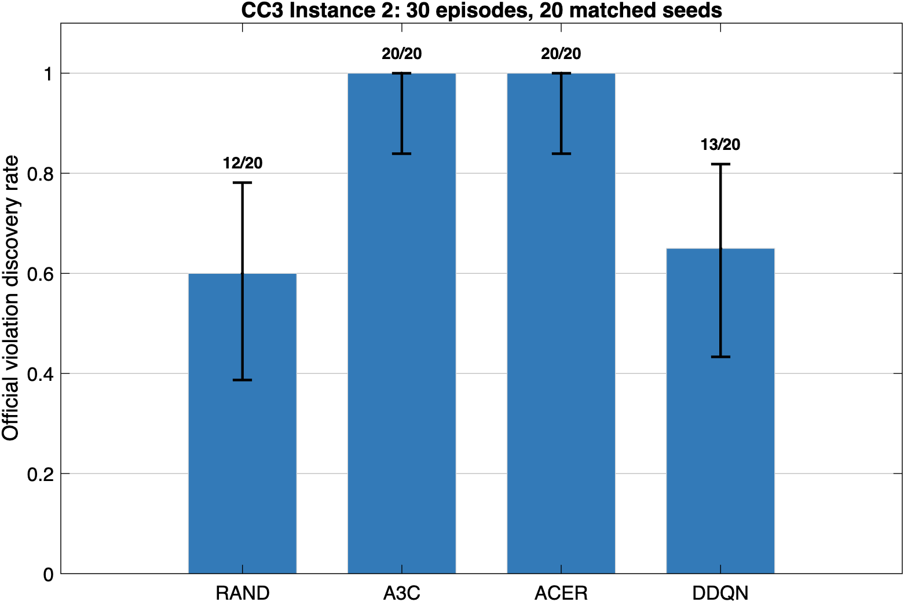

# 2026-09-03 ゼミ報告：Falsify × ARCH-COMP 2025

## 30秒で伝える結論

ARCH-COMP 2025の7モデル・47要求/Instance条件をFalsifyへ接続し、4探索法を掛け合わせた188ケースについて、候補生成から公式モデル再生・公式STL判定までを一括実行できるようにした。意味監査後の修正版でも188/188件を一括完走した。さらにCC3 Instance 2で、RAND/A3C/ACER/DDQNを共通20 seed・各30 episodeの固定予算で比較し、80/80 runの公式再検証に成功した。公式違反発見率はRAND 60%、A3C 100%、ACER 100%、DDQN 65%で、対応のある検定でもA3C/ACERはRANDより高かった。ただし、これは1要求だけの結果であり、全ベンチマークでRL優位と一般化はしない。

## 研究の最終ゴール

最終ゴールは、単にFalsify上で負のrobustnessを得ることではない。次を再現可能な実験として成立させ、RLを用いる探索法がランダム探索より要求違反入力を効率よく発見できるかを公平に評価することである。

1. ARCH-COMP公式の入力範囲、時間長、補間法、要求式を使う。
2. RAND、A3C、ACER、DDQNを同一条件・複数seedで実行する。
3. 見つけた入力をFalsify内部だけで判定せず、公式モデルへ同じ入力を再投入する。
4. 公式軌道に対して公式STL robustnessを再計算する。
5. 違反発見率、違反までのepisode数、実行時間を比較し、統計的に報告する。

第一目標の「全対象ベンチマークを動かして公式再判定できる基盤」は完了した。次段階だった複数seed・同一simulation予算の性能比較も、CC3 Instance 2について20 seedまで完了した。残る研究拡張は、他要求での再現確認、FIMによるfault injection、他ツール比較である。

## 実際に動いている処理

```text
RAND / A3C / ACER / DDQN
          ↓ 次の正規化actionを選ぶ
Simulink上のFalsifyラッパー
          ↓ actionを公式入力範囲へ変換
対象モデルをシミュレーション
          ↓ 状態軌道とオンラインmonitor値
S-TaLiRoのdp_taliroでrobustnessを計算
          ↓ 最良候補入力を保存
入力範囲・区分一定/線形構造を検査
          ↓ 同一入力
ARCH-COMP公式モデルで再シミュレーション
          ↓ 公式軌道
公式STL robustnessと成立/違反を最終記録
```

robustnessは、正なら要求成立、負なら要求違反、0付近なら境界を意味する。探索法はrobustnessを小さくし、最終的に負となる入力を探す。

## 今回の3成果

### 1. PUSH済みcommitから188ケースをクリーン一括再現

- 対象: SB 20、AT 80、AFC 12、CC 48、NN 16、F16 4、SC 8、合計188ケース
- 条件: 各ケース1 episode、RAND/A3C/ACER/DDQN、resumeなし、ラッパー再構築あり
- 結果: 188/188 `VALIDATED`、error 0、MATLAB終了code 0
- 実行元: `9ed78caa6647decfb7fdbe600f9ff6dc93837a52`
- 結果: `results/arch2025/reproduction_20260902_9ed78ca/arch2025_all_summary.csv`
- summary SHA-256: `b62e273f3ca1d7f093d73313356e0bc87558c4502c29773b35d01de124c26f7b`
- report SHA-256: `22858b9661b85b8e00c3af98e812e0f17a0f1f70faa263ad48f7ad9f91517049`

ここでいう `VALIDATED` は、Falsify完走、入力検査、公式再生、Falsify側と公式側の成立/違反分類一致を意味する。軌道の数値完全一致を意味しない。また、後述するNN意味対応の誤りを監査で発見したため、この旧commitのNN 16件と公式違反数31件は最終的な科学的結果としては使用しない。

### 2. 軌道差を調査し、ATとNNを修正

- AT: Falsifyが全モデルへ強制していた `AbsTol=1e-5` をARCH-COMP実行では外し、公式モデルのsolver設定を生成ラッパーへコピーするようにした。
- NN: 状態が誤って `[Pos, Ref]` になり、Posも `Pos/5` と誤正規化されていた。これを `[Ref, Pos]`、`[Ref-2, 0.4*Pos-1]` へ修正した。
- NN公式再生: 公式root Outport 1はPos、Outport 2はNNPosであり、どちらもRefではない。Refは外部入力なので、その対応へ修正した。
- NN同一seed代表例: 最大軌道誤差は `3.0246` から `0.03439` へ約88分の1に低下し、分類も一致した。
- 修正後RAND回帰: 47/47件 `VALIDATED`。NN 4件の最大軌道誤差中央値は `0.02593`。
- 意味修正版の全回帰: 188/188件 `VALIDATED`、error 0、NN 16/16件で公式分類一致、公式違反候補15件、軌道診断PASS 6/188件。
- CC: 同一外部入力を公式モデルとFalsify基礎モデルへ与えた比較は最大誤差`1.1e-13`以下だった。RL agentを保存actionのFrom Workspace入力へ置換した比較でもwrapper側の軌道差が再現した。一方、wrapperと公式モデルを同じ固定ステップ`ode4, 0.01秒`で比較すると最大誤差は`0`だった。したがって残差の原因は物理モデルやaction列ではなく、online monitor等を含むwrapperと公式runnerで可変ステップsolverの内部積分経路が異なることにある。正式結果では公式runnerの設定を優先し、`TrajectoryEquivalencePass` は独立した数値診断としてFAILのまま記録する。

修正後RAND回帰のsummary SHA-256は `510b0a128cfc52caa87df443b27522e2d7552f53c86d05b0263c65be86dfb9eb`。47件の計算とレポート出力は完了したが、その後MATLABが終了処理中にcode 137で落ちた。このため「計算結果47/47」は使えるが、「プロセスの正常終了」とは表現しない。別の188件一括runとpilot 12 runでは正常終了を確認している。

意味修正版188件の完全runは `results/arch2025/corrected_full188_20260902` に保存した。

- source summary SHA-256: `9cb7ade01d051aa86ec256d56ae5d734c91b2eb4b74a865ef25393ca628eafb1`
- source report SHA-256: `3098a1d89d767be09bd6521cf345a709e7dd5777056809439bbcb6deae1e768e`
- 公開用final summary SHA-256: `b97d9a6dbecf1f2b23bbf9aed266e8c963b9fc2a99d6e12862660b881e85384b`
- 公開用violations SHA-256: `4479f3d21be5bb704364f8abc93b3bee93ea0c57ed734f0a3d7ec9981b7262a1`

### 3. 実際のRL性能pilotを実行

条件はCC3 Instance 2、各手法3 seed、最大30 episodeである。候補はすべて公式モデルへ再投入して判定した。

| Algorithm | 公式違反発見 | 発見率 | 全runのepisode中央値 | 違反までのepisode中央値 | Falsify時間中央値 |
|---|---:|---:|---:|---:|---:|
| RAND | 1/3 | 33.3% | 30 | 19 | 55.06秒 |
| A3C | 3/3 | 100% | 4 | 4 | 16.97秒 |
| ACER | 3/3 | 100% | 3 | 3 | 13.80秒 |
| DDQN | 3/3 | 100% | 7 | 7 | 18.64秒 |

- 12/12 runが `VALIDATED`。
- 公式モデルで負のrobustnessを再確認した成功runは10/12。
- compact結果: `results/arch2025/pilot_cc3_i2_20260902/pilot_summary.csv`
- 全12 run: `results/arch2025/pilot_cc3_i2_20260902/pilot_runs.csv`
- manifest: `results/arch2025/pilot_cc3_i2_20260902/pilot_manifest.json`
- runs SHA-256: `494b6586a6c156917c3575fbf3c04d16d23a5892142677dea5bef60c101d3776`
- summary SHA-256: `427c0081ac4f384450299872df5a226c9ac4d4b10ff2483bab12473454275f16`

manifestには実行時のHEAD `9ed78ca` と `git_worktree_dirty=true` が記録されている。これは、pilotが旧commit単体ではなく、この報告で説明したAT/NN等の意味修正を作業ツリーへ適用した状態で実行されたことを示す。修正コードとcompact結果を今回同じcommitへ固定し、以後はそのcommitから再実行できるようにする。

このpilotは有望な傾向を示すが、「RLがRANDより優れる」と結論づけるには小さすぎる。特にDDQNは `replay_start_size=500` で、成功は最大14 episode、CCではおよそ20 action/episodeなので、いずれも本格的なexperience replay学習開始前である。DDQNの成功は学習済み方策の優位ではなく、未学習networkとOrnstein-Uhlenbeck探索雑音による可能性が高い。

### 4. 固定予算・共通20 seedの性能実験を完走

3-seed pilotの問題を解消するため、途中で負のFalsify robustnessを得ても止めず、全手法が必ず30 episodeを実行する `--fixed-budget` を追加した。これにより、早期停止した手法だけsimulation回数が少なくなる偏りと、Falsifyラッパーの浅い負値で公式モデル確認前に探索が止まる問題を避けた。seedは `20251001` から `20251020` までを全手法で共通にした。

| Algorithm | 有効run | 公式違反発見 | 発見率 | Wilson 95% CI | Falsify時間中央値 | 公式robustness中央値 |
|---|---:|---:|---:|---:|---:|---:|
| RAND | 20/20 | 12/20 | 60% | 38.7–78.1% | 56.96秒 | -0.203 |
| A3C | 20/20 | 20/20 | 100% | 83.9–100% | 81.32秒 | -3.120 |
| ACER | 20/20 | 20/20 | 100% | 83.9–100% | 60.22秒 | -4.781 |
| DDQN | 20/20 | 13/20 | 65% | 43.3–81.9% | 79.77秒 | -4.429 |

- 80/80 runでFalsify完走、入力検査、公式モデル再生、MATLAB正常終了を確認した。
- 全80 runが指定どおり30 episodeを実行した。
- 公式分類との一致は79/80。RANDの1件だけ符号不一致だったが、入力検査と公式再生は成功しており、正式集計では公式分類を使用した。
- 共通seedを使う正確McNemar検定では、A3C対RANDとACER対RANDがともに未補正 `p=0.0078125`、3比較のHolm補正後 `p=0.0234375`。DDQN対RANDは `p=1.0` だった。
- したがって、このCC3 Instance 2・30 episode条件ではA3C/ACERの発見率はRANDより高かった。ただし、1要求だけなので全ベンチマークへの一般化はしない。
- DDQNは約600遷移の後半で `replay_start_size=500` に到達した。今回は学習開始前だけの結果ではないが、学習期間は短く、収束を示す実験ではない。
- 固定予算では全runのepisode数が30になるため、「反例までのepisode数」は今回の指標から除外した。公式反例が最初に現れたepisodeを測るにはepisode単位の公式replayを追加する必要がある。



成果物:

- manifest: `results/arch2025/cc3_i2_fixed30_20seed_20260903/pilot_manifest.json`
- 80 run: `results/arch2025/cc3_i2_fixed30_20seed_20260903/pilot_runs.csv`
- 集計: `results/arch2025/cc3_i2_fixed30_20seed_20260903/pilot_summary.csv`
- 対応比較: `results/arch2025/cc3_i2_fixed30_20seed_20260903/pairwise_vs_rand.csv`
- 図: `results/arch2025/cc3_i2_fixed30_20seed_20260903/official_violation_rate.png`
- manifest SHA-256: `9f5b1698a00fbb10e9892b40f4a65cc7c10e3d4c4457748e55190c622022ba41`
- runs SHA-256: `3124e42bee2a1426d4376e2144c7d98dabaf799b24dba4b16f3da2fcce6cb159`
- summary SHA-256: `9e54b7693d550e22fe72f495666d53889d49432536c52183d7d62e2892de4fb1`
- pairwise SHA-256: `b4babb5dabd6d932651a0607e92adfe0576c7c3b11620c950866ec80f4bb6a97`

実験はPUSH済みcommit `cfb402f26d04ff9517e5216a0c526ac667ff08a4` を記録している。manifestの `git_worktree_dirty=true` は、管理対象外の診断ファイルとユーザー変更中の `metascript.m` が存在したためである。実験に使った `driver.py`、`falsify.m`、`validate_arch2025_all.m`、`run_arch2025_rl_pilot.py` のSHA-256はすべて同commitの内容と一致することを確認した。

## 各ソフトウェアの役割

| 要素 | この研究での役割 | 使っていないこと |
|---|---|---|
| Falsify | episode反復、Simulink実行、候補入力と最良robustnessの管理 | 公式判定そのものではない |
| Simulink | AT/AFC/CC/NN/SCなどの動的システムとRL接続ラッパーを時間発展させる | RLアルゴリズム本体ではない |
| MATLAB | 実験条件作成、Python連携、入力検査、公式再生、CSV/trace出力を統括する | A3C/ACER/DDQNのnetwork学習本体ではない |
| S-TaLiRo `dp_taliro` | STL式と時間軌道からrobustnessを計算する | 入力を探索するエージェントではない |
| Chainer | neural network、optimizer、自動微分の基盤 | 物理モデルを解くものではない |
| ChainerRL | A3C、ACER、Double DQN、replay buffer、explorationを実装する | ARCH-COMP公式モデルではない |
| Deep Learning Toolbox | SBで配布済みFalBenchGen LSTMをロードし推論するために使用する | 今回のA3C/ACER/DDQNには使用していない |
| ARCH-COMP 2025 | モデル、Instance、入力制約、STL要求を定義する評価基準 | 探索アルゴリズムではない |

つまり「RL = Deep Learning Toolbox」ではない。このリポジトリのRLは主にPython側のChainerRLで動く。Deep Learning Toolboxは別用途で、SBというニューラルネットワーク・サロゲートモデルの推論に使う。

## RLの1 episodeで起きること

1. Simulinkモデルを初期化する。
2. 現在状態を各成分 `[-1, 1]` に正規化してPythonへ渡す。
3. RANDまたはChainerRL agentが正規化action `[-1, 1]` を返す。
4. MATLAB System blockがactionを公式入力範囲へ変換し、指定の線形/区分一定補間でモデルへ入れる。
5. オンラインmonitorが途中のrobustness情報をagentへ返す。
6. episode終了後、`dp_taliro`で軌道全体のrobustnessを計算する。
7. 通常runは負なら早期終了する。公平な性能比較では早期終了を無効化し、全手法が固定episode予算を完走する。
8. 保存した候補入力を公式モデルで再生し、公式robustnessを最終結果にする。

現在のARCH-COMP設定では `config.alpha=0` なので、途中stepのreward `exp(-alpha*r)-1` は0である。episode終端では `exp(-R)-1` を渡すため、実質的に疎な終端rewardで学習する。これは再現性のある現状設定だが、今後の性能研究ではalpha、reward設計、DDQNのwarm-upを実験要因として見直す必要がある。

## 次に行うこと

1. CC3だけの結果に偏らないよう、CCの別要求とATの代表要求で同じ固定予算実験を再現する。
2. 初回公式反例までのsimulation数を測るため、episode単位の公式replayと停止時点記録を追加する。
3. 第一目標とCC3性能実験は完了したため、指導教員とfault operatorを決めてCCまたはATのFIM proof-of-conceptへ進む。

## 再実行コマンド

全188ケース、1 episode、クリーン再実行:

```sh
/Applications/MATLAB_R2026a.app/bin/matlab -batch "setenv('FALSIFY_ARCH2025_CASE_FILTER',''); setenv('FALSIFY_ARCH2025_RESUME_PASSED','0'); setenv('FALSIFY_ARCH2025_REBUILD_WRAPPERS','1'); setenv('FALSIFY_ARCH2025_MAX_EPISODES','1'); setenv('FALSIFY_ARCH2025_SEED_OVERRIDE',''); setenv('FALSIFY_ARCH2025_OUTPUT_DIR','results/arch2025/corrected_full188_20260902'); validate_arch2025_all"
```

pilotの再実行:

```sh
.venv-falsify/bin/python run_arch2025_rl_pilot.py \
  --case-prefix cc_cc3_i2 \
  --algorithms RAND A3C ACER DDQN \
  --seeds 20250903 20250904 20250905 \
  --episodes 30 \
  --output-root results/arch2025/pilot_cc3_i2_20260902
```

固定予算20-seed実験の再実行:

```sh
.venv-falsify/bin/python run_arch2025_rl_pilot.py \
  --case-prefix cc_cc3_i2 \
  --algorithms RAND A3C ACER DDQN \
  --seeds 20251001 20251002 20251003 20251004 20251005 \
          20251006 20251007 20251008 20251009 20251010 \
          20251011 20251012 20251013 20251014 20251015 \
          20251016 20251017 20251018 20251019 20251020 \
  --episodes 30 \
  --fixed-budget \
  --rebuild-wrappers \
  --output-root results/arch2025/cc3_i2_fixed30_20seed_20260903
```

対応のある統計比較と図の再生成:

```sh
.venv-falsify/bin/python analyze_arch2025_rl_results.py \
  --runs results/arch2025/cc3_i2_fixed30_20seed_20260903/pilot_runs.csv \
  --output results/arch2025/cc3_i2_fixed30_20seed_20260903/pairwise_vs_rand.csv

/Applications/MATLAB_R2026a.app/bin/matlab -batch "plot_arch2025_rl_experiment('results/arch2025/cc3_i2_fixed30_20seed_20260903/pilot_summary.csv','results/arch2025/cc3_i2_fixed30_20seed_20260903/official_violation_rate.png')"
```
